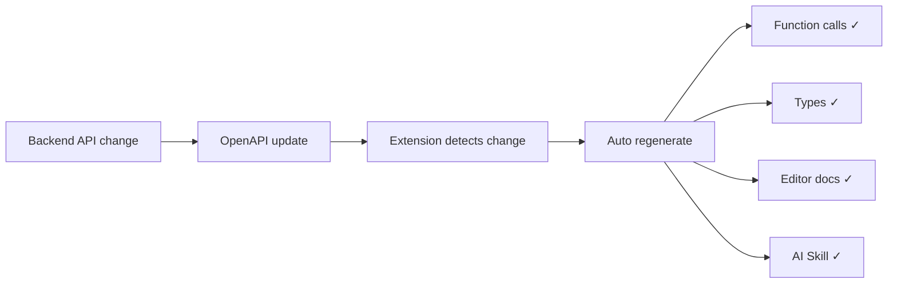

The VSCode extension embeds the API information generated by worma directly into the editor, so you can look up APIs and write code without switching tools.

## Install the VSCode extension

<a
  href="vscode:extension/worma.worma-vscode"
  style={{
    display: "inline-block",
    padding: "0 24px",
    background: "#ff701e",
    color: "#fff",
    borderRadius: "6px",
    textDecoration: "none",
    fontWeight: 500,
    cursor: "pointer",
    lineHeight: "1",
  }}
>
  Install the Worma extension in VSCode
</a>

Or search for **"worma"** in the marketplace.

> **Can't find the extension?** Because the VSCode Marketplace publishing process is currently restricted, the extension may not be searchable in the marketplace. In that case, go to [open-vsx.org](https://open-vsx.org/extension/worma/worma-vscode) to download the latest `.vsix` package, then install it manually in VSCode via the `···` menu at the top-right of the Extensions panel and choosing **Install from VSIX...**.

## Hover for API details

After installing the extension, hover over a generated API call:

```typescript
import { getUserInfo } from "./api/user";

const user = await getUserInfo({
  pathParams: { id: "123" },
});
//       ^ hover here
```

The popup shows:

```text
GET /api/v1/users/{id}

Get user info

Path Parameters
  id : string    User ID

Query Parameters
  include : string?    Related data to include

Response
  code    : number
  data    : {
    id       : string
    name     : string
    email    : string
  }
  message : string
```

## Sidebar API explorer

The extension adds an API explorer panel to the VSCode sidebar:

```
User Service
├── user
│   ├── GET  /api/v1/users/{id}      Get user info
│   ├── POST /api/v1/users           Create user
│   └── GET  /api/v1/users           User list
├── article
│   ├── GET  /api/v1/articles        Article list
│   └── POST /api/v1/articles        Create article
└── order
    └── ...
```

- **Grouped by tag** — consistent with OpenAPI tags, easy to find by module
- **Search** — search by API name, path, or description directly in the panel
- **Multi-service** — multiple OpenAPI documents are grouped by `serverName`

## Auto-detect changes

The extension automatically detects OpenAPI changes and regenerates when backend APIs update:



## JS projects get TS-level hints too

Even with plain JavaScript, the `.d.ts` files generated by worma give VSCode full type hints and doc display:

```javascript
// In a .js file, hover works just the same
import { getUserInfo } from "./api/user";

const user = await getUserInfo({ pathParams: { id: "123" } });
// You still see the parameter table and response structure
```

## Browse APIs in the sidebar

After generating APIs, view all API docs in the API explorer panel in the VSCode sidebar.


## Find an API quickly

You can locate an API by its `description` or `url` keyword. Open the API search box by:

- **Shortcut**: `Ctrl+Alt+P` (Mac: `Command+Option+P`)
- **Trigger word**: type `a->`

### Find by URL

Type a URL keyword to quickly locate the matching API.


### Find by description

Type an API description keyword to locate it quickly.


### Fill parameters against the table

By default, when you open an API function via `a->`, the extension auto-provides its required parameters. When you pass arguments to the API function, VSCode also pops up the API doc so you can fill parameters against the table.


If you closed the API doc popup, place the cursor on the API function and press `Shift+Ctrl+Space` (Mac: `Shift+Command+Space`) to bring it back.

## 📖 View Api CodeLens

The extension shows a `📖 View Api` CodeLens above matched API function calls. Click it to view the API doc instantly — no hover or search needed:

```typescript
import { getUserInfo } from "./api/user";

const user = await getUserInfo({ pathParams: { id: "123" } });
// 📖 View Api: .getUserInfo   <- click here to view API docs
```

## Extension settings

The extension supports the following VSCode settings (all configured in VSCode's `settings.json` — the **User** or **Workspace** settings in the Settings panel; the workspace file is `.vscode/settings.json` at the project root):

### Auto-update APIs

After **extension activation** and on **window refocus**, the extension silently checks whether your configured OpenAPI source changed; it only prompts when a change is detected, and **regenerates only after your confirmation** — it never rewrites code silently.

Control when auto-detection runs with the `worma.autoUpdate` setting (all optional, on by default):

```json
// .vscode/settings.json
{
  "worma.autoUpdate": {
    "checkOnActivation": true,
    "checkOnWindowFocus": true,
    "minInterval": 300000
  }
}
```

| Setting | Type | Default | Description |
| ------- | ---- | ------- | ----------- |
| `checkOnActivation` | `boolean` | `true` | Run a silent check ~1.5s after activation |
| `checkOnWindowFocus` | `boolean` | `true` | Check each time the VS Code window regains focus |
| `minInterval` | `number` | `300000` | Minimum interval between two checks (ms), default 5 minutes |

- Both switches default to `true`; if both are `false`, no auto-detection runs.

### Review API changes

After each successful `generate`, if APIs were added / removed / modified, a change record is written under the `changes/` cache directory (matched by `method + path`, down to field-level `changedFields`).

How to view:

- Bottom status bar QuickPick → `Review API Changes`
- Command palette → `Worma: Review API Changes` (runs `worma.openChanges`, defaults to the latest record)

The Webview groups `added / removed / modified` and specific changed fields by generator (output), supports search by tag / field name, and clicking an entry jumps to the generated source file.

> When `added / removed / modified` are all 0 (no API change at all), no record is written and no prompt shows.

See [Worma CLI Commands](./cli-commands.mdx#worma-diff) for the full command-line way to browse.

### Show / hide the View Api CodeLens

The `worma.enableViewApiLens` setting controls whether the `📖 View Api` CodeLens shows above matched API function calls; on by default.

Set it to `false` to hide the CodeLens:

```json
// .vscode/settings.json
{
  "worma.enableViewApiLens": false
}
```

Changes take effect immediately — no VSCode restart needed.
