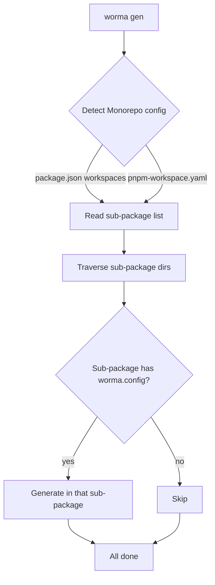

If your project is a Monorepo, worma automatically reads the `workspaces` field in the root `package.json` or `pnpm-workspace.yaml`, detects sub-packages, and runs the generation command in each sub-package that contains a `worma.config.[j|ts]`.

## How it works



## Example project structure

<Files>
  <Folder name="my-monorepo" defaultOpen>
    <File name="package.json" />
    <File name="pnpm-workspace.yaml" />
    <Folder name="packages" defaultOpen>
      <Folder name="user-service" defaultOpen>
        <File name="worma.config.js" />
        <Folder name="src" />
      </Folder>
      <Folder name="order-service" defaultOpen>
        <File name="worma.config.js" />
        <Folder name="src" />
      </Folder>
    </Folder>
  </Folder>
</Files>

## Usage

Run in the Monorepo root:

```bash
worma gen
```

worma automatically:

1. Reads `package.json`'s `workspaces` or `pnpm-workspace.yaml`
2. Traverses all sub-package directories
3. Runs generation in each sub-package that contains a `worma.config.[j|ts]` or `.wormarc`
4. Aggregates and shows the generation status of all sub-packages

## Generate a single sub-package

If you only need one sub-package's API code, use `--project` to point at it:

```bash
worma gen --project ./packages/user-service
```

This skips the Monorepo scan and generates only in the specified sub-package.

## Sub-package config example

Each sub-package can configure its own OpenAPI URL, template, and plugins independently:

```javascript
// packages/user-service/worma.config.js
import { defineConfig } from 'wormajs';
import { axios } from 'wormajs/plugin';
import { aiDoc } from 'wormajs/plugin';

export default defineConfig({
  generator: [
    {
      input: 'https://user-service.example.com/openapi.json',
      output: 'src/api',
      serverName: 'User Service',
      plugins: [axios(), aiDoc()],
    },
  ],
});
```

## Manage centrally from the root

You can also configure all sub-services centrally in the root `worma.config`:

```javascript
import { defineConfig } from 'wormajs';
import { axios } from 'wormajs/plugin';

export default defineConfig({
  generator: [
    {
      input: 'https://user-service.example.com/openapi.json',
      output: 'packages/user-service/src/api',
      serverName: 'User Service',
      plugins: [axios()],
    },
    {
      input: 'https://order-service.example.com/openapi.json',
      output: 'packages/order-service/src/api',
      serverName: 'Order Service',
      plugins: [axios()],
    },
  ],
});
```

> When managing centrally from the root, each generator's `output` should point to the corresponding sub-package directory, and it is recommended to set `serverName` for each.
