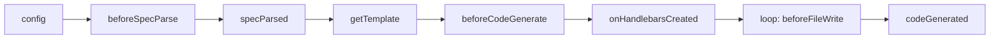

If you'd rather not write a plugin from scratch, install the worma Skill and let the AI coding assistant build a custom plugin from this page's docs:

```bash
npx skills add alovajs/skills --skill worma-guidelines
```

Then describe your need in the AI chat, e.g.:

```text
Help me build a custom worma plugin. My requirement is: xxx
```

## Lifecycle



Plugins hook into each stage of code generation in this order:

```
config() → beforeSpecParse() → parse OpenAPI → specParsed()
→ getTemplate()                ← plugin returns the template path
→ beforeCodeGenerate(data)     ← plugin injects config data into templateData
→ onHandlebarsCreated(hbs)     ← can register custom helpers/partials
→ streaming render + write:
    loop each file:
       beforeFileWrite(filePath, content)  ← plugin modifies a single file's content
       writeFile(filePath)
→ codeGenerated(filePaths, renderTemplate)     ← notify / generate extra files (aiDoc, etc.)
```

## Basic structure

A custom plugin is simply an object implementing the `ApiPlugin` interface:

```javascript
import { defineConfig } from 'wormajs';

export default defineConfig({
  generator: [
    {
      plugins: [
        {
          name: 'my-custom-plugin',

          // Stage 1: config stage
          config({ config, projectPath, reportProgress }) {
            // modify config
            return modifiedConfig;
          },

          // Stage 2: before spec parsing, can transform the raw spec text
          beforeSpecParse({ spec, config, projectPath, reportProgress }) {
            // spec is the raw spec text (JSON/YAML string); config is frozen, not modifiable
            // return a new string to replace it before parsing; return nothing to keep the original
            return spec.replace('"version": "1.0"', '"version": "1.0.0"');
          },

          // Stage 3: after OpenAPI parsing, can modify the document
          async specParsed({ document, reportProgress }) {
            reportProgress(30, 'processing...');
            // modify document
            return modifiedDocument;
          },

          // Stage 4: get template path (optional)
          getTemplate({ config, projectPath }) {
            // return the template path; return nothing to use another plugin's template
            return { path: './my-template' };
          },

          // Stage 5: before code generation, modify TemplateData directly
          beforeCodeGenerate({ data, reportProgress }) {
            // modify the data object directly; no return needed
            data.apis = data.apis.map(api => ({
              ...api,
              name: `api_${api.name}`,
            }));
          },

          // Stage 6: after Handlebars instance creation, can register custom helpers/partials
          onHandlebarsCreated({ hbs, config, reportProgress }) {
            // full access to the Handlebars instance, register a custom helper
            hbs.registerHelper('uppercase', (str) => str.toUpperCase());
          },

          // Stage 7: before each file write, can modify a single file's content
          beforeFileWrite({ filePath, content, fileName }) {
            if (fileName.endsWith('.ts')) {
              return `// Auto-generated by worma\n\n${content}`;
            }
          },

          // Stage 8: after code generation, notify completion / render extra templates
          codeGenerated({ filePaths, data, reportProgress, renderTemplate }) {
            reportProgress(100, 'completed');
            // filePaths is the list of written file paths
            console.log('Generated files:', filePaths);

            // render an extra template into a directory via renderTemplate
            await renderTemplate({
              templatePath: './my-extra-template',
              type: 'typescript',
              outputDir: './output/extra',
              data: extraTemplateData,
            });
          },
        },
      ],
    },
  ],
});
```

## Progress reporting

If a plugin runs a slow operation, report its progress via `reportProgress`. Each plugin instance binds its own `reportProgress`, using the plugin `name` as the source label:

```javascript
{
  name: 'remoteSchema',
  async specParsed({ document, reportProgress }) {
    reportProgress(10, 'fetching schema patches');
    await fetchPatches();
    reportProgress(60, 'merging');
    await merge(document);
    reportProgress(100, 'done');
  },
}
```

> When a plugin doesn't declare `name`, the source falls back to `'plugin'` (anonymous plugins overwrite each other).

## Modify a single file with beforeFileWrite

```javascript
{
  name: 'license-header',
  beforeFileWrite({ filePath, content, fileName }) {
    if (fileName.endsWith('.ts') || fileName.endsWith('.d.ts')) {
      return `// Copyright 2026 Your Company\n\n${content}`;
    }
  },
}
```

## Recommended: use the `createPlugin` factory

To let a plugin accept user params, define it with the `createPlugin` factory, which ties the passed config to the lifecycle hooks.

```typescript
import type { ApiPlugin } from 'wormajs';
import { createPlugin } from 'wormajs/plugin';

interface Config {
  match: (tag: string) => boolean;
  handler: (tag: string) => string;
}

const createTagModifierPlugin = createPlugin((config: Config): Partial<ApiPlugin> => ({
  name: 'tag-modifier-plugin',

  specParsed({ document }) {
    const paths = document.paths || {};
    for (const [path, methods] of Object.entries(paths)) {
      for (const method of Object.values(methods || {})) {
        if (method?.tags) {
          method.tags = method.tags
            .filter(config.match)
            .map(config.handler);
        }
      }
    }
    return document;
  },
}));
```

### Usage

```javascript
import { defineConfig } from 'wormajs';
import { createTagModifierPlugin } from './my-plugins';

export default defineConfig({
  generator: [
    {
      plugins: [
        createTagModifierPlugin({
          match: tag => tag.includes('user'),
          handler: tag => `api_${tag}`,
        }),
      ],
    },
  ],
});
```

### `createPlugin` signature

```typescript
function createPlugin<T>(
  factory: (config: T) => Partial<ApiPlugin>
): (config: T) => ApiPlugin;
```

`createPlugin` takes a factory function, called when the plugin is initialized. It receives the user's config and returns the lifecycle hook object. The returned function can be configured directly in the `plugins` array.

### Full example

A custom plugin combining multiple lifecycle hooks:

```javascript
import { createPlugin } from 'wormajs/plugin';

const createCustomPlugin = createPlugin((options) => ({
  name: 'custom-plugin',

  config({ config }) {
    // inject custom config at the config stage
    config.externalTypes = config.externalTypes || [];
    config.externalTypes.push(...(options.types || []));
    return config;
  },

  async specParsed({ document, reportProgress }) {
    reportProgress(30, 'processing document');
    return document;
  },

  beforeCodeGenerate({ data }) {
    // modify data directly; no return needed
    data.apis = data.apis.map(api => ({
      ...api,
      name: `${options.prefix || ''}${api.name}`,
    }));
  },
}));
```

## Full type definition

```typescript
type ReportProgress = (progress: number, message?: string) => void;

interface ApiPlugin {
  name?: string;

  /** ① config stage: can modify config */
  config?: (params: {
    config: GeneratorConfig;
    projectPath: string;
    reportProgress: ReportProgress;
  }) => MaybePromise<GeneratorConfig | undefined | null | void>;

  /** ② before spec parsing: gets the raw spec text, can return a new string to replace before parsing */
  beforeSpecParse?: (params: {
    config: Readonly<GeneratorConfig>;
    /** Raw spec text (JSON or YAML), the string content before parsing */
    spec: string;
    projectPath: string;
    reportProgress: ReportProgress;
  }) => MaybePromise<string | undefined | null | void>;

  /** ③ after OpenAPI parsing: can modify document */
  specParsed?: (params: {
    config: Readonly<GeneratorConfig>;
    document: OpenAPIDocument;
    projectPath: string;
    reportProgress: ReportProgress;
  }) => MaybePromise<OpenAPIDocument | undefined | null | void>;

  /** ④ get template path */
  getTemplate?: (params: {
    config: Readonly<GeneratorConfig>;
    projectPath: string;
    reportProgress: ReportProgress;
  }) => MaybePromise<TemplateConfigResult | undefined | null | void>;

  /** ⑤ before rendering: inject/modify templateData */
  beforeCodeGenerate?: (params: {
    config: Readonly<GeneratorConfig>;
    data: TemplateData;
    projectPath: string;
    reportProgress: ReportProgress;
  }) => MaybePromise<void>;

  /** ⑥ after Handlebars instance creation: can register custom helpers/partials */
  onHandlebarsCreated?: (params: {
    hbs: typeof import('handlebars');
    config: Readonly<GeneratorConfig>;
    projectPath: string;
    reportProgress: ReportProgress;
  }) => MaybePromise<void>;

  /** ⑦ before each file write: can modify a single file's content */
  beforeFileWrite?: (params: {
    filePath: string;
    content: string;
    fileName: string;
    tag?: string;
    api?: string;
    config: Readonly<GeneratorConfig>;
    data: TemplateData;
    projectPath: string;
    isNoOverwrite: boolean;
  }) => MaybePromise<string | void>;

  /** ⑧ after all files are written */
  codeGenerated?: (params: {
    config: Readonly<GeneratorConfig>;
    data: TemplateData;
    filePaths: string[];
    projectPath: string;
    outputDir: string;
    error?: Error;
    reportProgress: ReportProgress;
    /** One-step helper: render a template into a directory; params match TemplateHelper.renderToDir */
    renderTemplate: (params: {
      templatePath: string;
      type: TemplateType;
      outputDir: string;
      data: TemplateData;
      options?: {
        changedTags?: Set<string>;
        beforeFileWrite?: (params: {
          filePath: string;
          content: string;
          meta: { templateType?: 'tag' | 'api'; tag?: string; api?: string };
        }) => MaybePromise<string>;
        writeConcurrency?: number;
        formatFile?: boolean;
      };
    }) => Promise<{ filePaths: string[] }>;
  }) => MaybePromise<void>;
}
```
