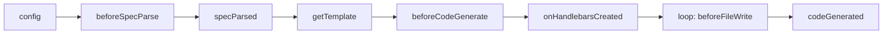

worma's plugin system lets you hook into each lifecycle stage of code generation and modify the result.

## Lifecycle



## Hook execution order

```
config() → beforeSpecParse() → parse OpenAPI → specParsed()
→ getTemplate()                ← plugin returns the template path
→ beforeCodeGenerate(data)     ← plugin injects config data into templateData
→ onHandlebarsCreated(hbs)     ← can register custom helpers/partials
→ streaming render + write:
    loop each file:
       beforeFileWrite(filePath, content)  ← plugin modifies a single file's content
       writeFile(filePath)
→ codeGenerated(filePaths, renderTemplate)     ← notify / generate extra files (aiDoc, etc.)
```

## Hook overview

| Hook | When | Can modify | config state |
| ---------------------- | ---------------- | ---------------- | ----------- |
| `config` | After config parsing | config | Mutable |
| `beforeSpecParse` | Before spec parsing | Raw spec text `spec` | Frozen |
| `specParsed` | After OpenAPI parsing | `document` | Frozen |
| `getTemplate` | Before template loading | Template path | Frozen |
| `beforeCodeGenerate` | Before code generation | `TemplateData` | Frozen |
| `onHandlebarsCreated` | After Handlebars instance creation | hbs instance / partials / helpers | Frozen |
| `beforeFileWrite` | Before each file write | Single file content | Frozen |
| `codeGenerated` | After all files written | `filePaths` / render extra templates via `renderTemplate` | Frozen |

## Progress reporting

If a plugin runs a slow operation, it can report its progress via `reportProgress`. Each plugin instance binds its own `reportProgress`, using the plugin `name` as the source label:

```typescript
type ReportProgress = (progress: number, message?: string) => void;
```
