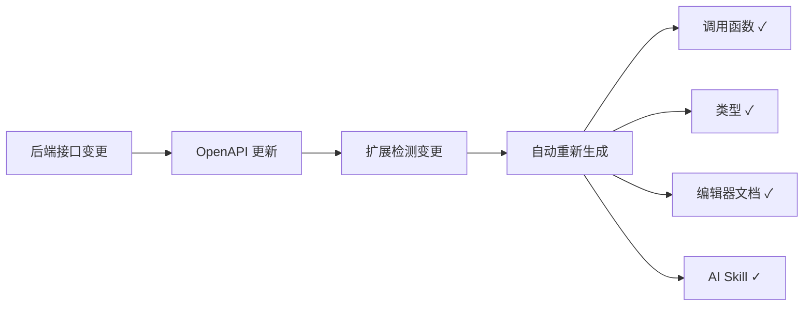

VSCode 扩展将 worma 生成的 API 信息直接嵌入到编辑器中，让你无需切换工具即可完成 API 查阅和代码编写。

## 安装 VSCode 扩展

<a
  href="vscode:extension/worma.worma-vscode"
  style={{
    display: "inline-block",
    padding: "0 24px",
    background: "#ff701e",
    color: "#fff",
    borderRadius: "6px",
    textDecoration: "none",
    fontWeight: 500,
    cursor: "pointer",
    lineHeight: "1",
  }}
>
  在 VSCode 中安装 Worma 扩展
</a>

或在扩展市场搜索 **"worma"**。

## 悬停查看 API 详情

安装扩展后，将鼠标悬停在生成的 API 调用上：

```typescript
import { getUserInfo } from "./api/user";

const user = await getUserInfo({
  pathParams: { id: "123" },
});
//       ^ 悬停此处
```

弹出的气泡窗口会显示：

```text
GET /api/v1/users/{id}

获取用户信息

Path Parameters
  id : string    用户 ID

Query Parameters
  include : string?    需要包含的关联数据

Response
  code    : number
  data    : {
    id       : string
    name     : string
    email    : string
  }
  message : string
```

## 侧边栏 API 浏览器

扩展在 VSCode 侧边栏添加了 API 浏览器面板：

```
用户服务
├── user
│   ├── GET  /api/v1/users/{id}      获取用户信息
│   ├── POST /api/v1/users           创建用户
│   └── GET  /api/v1/users           用户列表
├── article
│   ├── GET  /api/v1/articles        文章列表
│   └── POST /api/v1/articles        创建文章
└── order
    └── ...
```

- **按 tag 分组** — 与 OpenAPI 的 tag 一致，方便按模块查找
- **搜索功能** — 在面板中直接搜索接口名称、路径或描述
- **多服务支持** — 多个 OpenAPI 文档按 `serverName` 分组展示

## 自动检测变更

扩展自动检测 OpenAPI 文档变更，当后端接口更新时自动触发重新生成：



## JS 项目也能获得 TS 级别的提示

即使项目使用纯 JavaScript，worma 生成的 `.d.ts` 文件仍能让 VSCode 提供完整的类型提示和文档展示：

```javascript
// 在 .js 文件中，悬停一样有效
import { getUserInfo } from "./api/user";

const user = await getUserInfo({ pathParams: { id: "123" } });
// 同样能看到参数表和响应结构
```

## 在侧边栏浏览 APIs

生成 APIs 后，在 VSCode 侧边栏的 API 浏览器面板中可查看所有 APIs 文档。


## 快速查找 API

你可以通过目标 API 的 `description` 或 `url` 关键词快速定位到对应的 API，通过以下方式唤起 API 搜索框：

- **快捷键**：`Ctrl+Alt+P`（Mac: `Command+Option+P`）
- **触发词**：输入 `a->`

### 通过 URL 查找

输入 URL 关键词即可快速定位到对应 API。


### 通过描述查找

输入接口描述关键词也能快速定位。


### 对照接口参数表指定参数

默认情况下，通过 `a->` 快捷访问 API 函数时，扩展会自动提供该 API 的必要参数。当你调用 API 函数传参时，VSCode 编辑器也会自动弹出 API 文档，让你对照参数表填写参数。


如果关闭了 API 文档弹框，可将光标放在 API 函数上并通过快捷键 `Shift+Ctrl+Space`（Mac: `Shift+Command+Space`）再次唤起。
