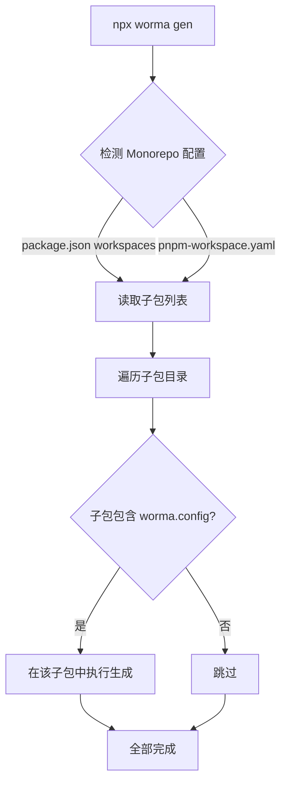

如果项目是一个 Monorepo 项目，worma 会自动在根目录读取 `package.json` 中的 `workspaces` 字段或 `pnpm-workspace.yaml`，自动识别子包并在各个包含 `worma.config.[j|ts]` 的子包中运行生成命令。

## 工作原理



## 项目结构示例

<Files>
  <Folder name="my-monorepo" defaultOpen>
    <File name="package.json" />
    <File name="pnpm-workspace.yaml" />
    <Folder name="packages" defaultOpen>
      <Folder name="user-service" defaultOpen>
        <File name="worma.config.js" />
        <Folder name="src" />
      </Folder>
      <Folder name="order-service" defaultOpen>
        <File name="worma.config.js" />
        <Folder name="src" />
      </Folder>
    </Folder>
  </Folder>
</Files>

## 使用方式

在 Monorepo 根目录执行：

```bash
npx worma gen
```

worma 会自动：

1. 读取 `package.json` 的 `workspaces` 或 `pnpm-workspace.yaml`
2. 遍历所有子包目录
3. 在每个包含 `worma.config.[j|ts]` 或 `.wormarc` 的子包中执行生成命令
4. 汇总显示所有子包的生成状态

## 指定生成单个子包

如果只需要生成某个子包的 API 代码，可以使用 `--project` 参数指定子包路径：

```bash
npx worma gen --project ./packages/user-service
```

这会跳过 Monorepo 扫描，仅在指定的子包目录中执行生成。

## 子包配置示例

每个子包可以独立配置自己的 OpenAPI 文档地址、模板和插件：

```javascript
// packages/user-service/worma.config.js
import { defineConfig } from 'wormajs';
import { axios } from 'wormajs/plugin';
import { aiDoc } from 'wormajs/plugin';

export default defineConfig({
  generator: [
    {
      input: 'https://user-service.example.com/openapi.json',
      output: 'src/api',
      serverName: '用户服务',
      plugins: [axios(), aiDoc()],
    },
  ],
});
```

## 根目录统一管理

也可以在 Monorepo 根目录的 `worma.config` 中统一配置所有子服务：

```javascript
import { defineConfig } from 'wormajs';
import { axios } from 'wormajs/plugin';

export default defineConfig({
  generator: [
    {
      input: 'https://user-service.example.com/openapi.json',
      output: 'packages/user-service/src/api',
      serverName: '用户服务',
      plugins: [axios()],
    },
    {
      input: 'https://order-service.example.com/openapi.json',
      output: 'packages/order-service/src/api',
      serverName: '订单服务',
      plugins: [axios()],
    },
  ],
});
```

> 根目录统一管理时，每个 generator 的 `output` 应指向对应子包的目录，同时建议为每个设置 `serverName`。
