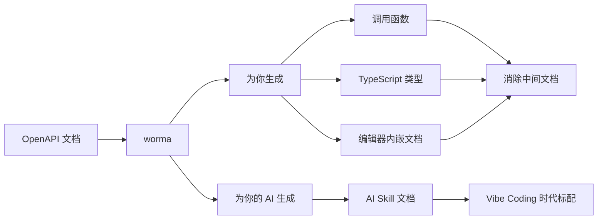

**消除你和服务端之间的一切距离。**

`worma` 的命名源自"虫洞"（wormhole）的概念——就像在宇宙中瞬间拉近两个遥远节点的虫洞一样，它消除你和后端之间的所有距离。你不需要打开 Swagger，不需要在文档站和编辑器之间反复切换，你的 AI 也不需要靠猜。

## 两条并行主线



**「消除中间文档」** —— 后端交付接口后，接口信息直接出现在你的编辑器里。不再需要打开 Swagger，不再需要复制参数，不再需要切换窗口。

**「AI Skill」** —— 你的 AI 也看不到接口文档？wormhole 为它生成专属的 Skill 文档，让 AI 直接读懂你的接口，精准生成调用代码。

## 从 v1 到 v2 的变化

v2 是一次重大升级，主要体现在：

| 维度 | v1 | v2 |
|------|----|----|
| 模板 | 仅 alova 全局模板 | 内置 alova / axios / fetch / ky + 自定义模板 |
| 插件系统 | — | 完整的生命周期 Hook 体系 |
| AI Skill | — | 专为 AI 编码工具生成的接口文档 |
| 缓存 | `node_modules/.alova`（不可提交） | `.worma-cache.json`（团队共享） |
| 模块类型 | 仅 TypeScript | typescript / module(ESM) / commonjs |
| 生成进度 | spinner | 多行进度条，支持 onProgress 回调 |

## 一次生成，四种产出

```bash
npx worma gen

# 生成后你得到：
# ✓ 调用函数      — 内置 alova / axios / fetch / ky
# ✓ TypeScript 类型 — 请求/响应全自动推导
# ✓ 编辑器内嵌文档   — VSCode 中悬停即看
# ✓ AI Skill 文档   — Cursor / Copilot 直接读取
```

准备好体验了吗？从[快速开始](/docs/quick-start)开始，5 分钟就能上手。
