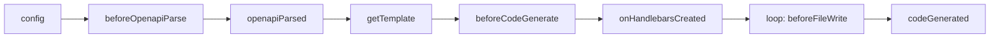

## 生命周期



插件按以下时序在代码生成的各阶段介入：

```
config() → beforeOpenapiParse() → 解析 OpenAPI → openapiParsed()
→ getTemplate()                ← 插件返回模板路径
→ beforeCodeGenerate(data)     ← 插件注入配置数据到 templateData
→ onHandlebarsCreated(hbs)     ← 可注册自定义 helpers/partials
→ 流式渲染 + 写盘：
    loop 每个文件:
       beforeFileWrite(filePath, content)  ← 插件修改单文件内容
       writeFile(filePath)
→ codeGenerated(filePaths)     ← 通知 / 生成额外文件（aiDoc 等）
```

## 基本结构

一个自定义插件就是一个实现了 `ApiPlugin` 接口的对象：

```javascript
import { defineConfig } from 'worma';

export default defineConfig({
  generator: [
    {
      plugins: [
        {
          name: 'my-custom-plugin',

          // 阶段 1：配置阶段
          config({ config, projectPath, reportProgress }) {
            // 可以修改 config
            return modifiedConfig;
          },

          // 阶段 2：OpenAPI 解析前
          beforeOpenapiParse({ config, projectPath, reportProgress }) {
            // config 已冻结，不可修改
          },

          // 阶段 3：OpenAPI 解析后，可修改文档内容
          async openapiParsed({ document, reportProgress }) {
            reportProgress(30, 'processing...');
            // 修改 document
            return modifiedDocument;
          },

          // 阶段 4：获取模板路径（可选）
          getTemplate({ config, projectPath }) {
            // 返回模板路径，不返回则使用其他插件的模板
            return { path: './my-template' };
          },

          // 阶段 5：代码生成前，直接修改 TemplateData
          beforeCodeGenerate({ data, reportProgress }) {
            // 直接修改 data 对象，无需返回值
            data.apis = data.apis.map(api => ({
              ...api,
              name: `api_${api.name}`,
            }));
          },

          // 阶段 6：Handlebars 实例创建后，可注册自定义 helpers/partials
          onHandlebarsCreated({ hbs, config, reportProgress }) {
            // 完全访问 Handlebars 实例，注册自定义 helper
            hbs.registerHelper('uppercase', (str) => str.toUpperCase());
          },

          // 阶段 7：每个文件写盘前，可修改单个文件内容
          beforeFileWrite({ filePath, content, fileName }) {
            if (fileName.endsWith('.ts')) {
              return `// Auto-generated by worma\n\n${content}`;
            }
          },

          // 阶段 8：代码生成后，通知完成
          codeGenerated({ filePaths, data, reportProgress }) {
            reportProgress(100, 'completed');
            // filePaths 是已写入的文件路径列表
            console.log('Generated files:', filePaths);
          },
        },
      ],
    },
  ],
});
```

## 进度报告

如果插件内存在耗时操作，可通过 `reportProgress` 报告插件内的处理进度。每个插件实例绑定独立的 `reportProgress`，以插件 `name` 作为 source 标识：

```javascript
{
  name: 'remoteSchema',
  async openapiParsed({ document, reportProgress }) {
    reportProgress(10, 'fetching schema patches');
    await fetchPatches();
    reportProgress(60, 'merging');
    await merge(document);
    reportProgress(100, 'done');
  },
}
```

> 插件未声明 `name` 时，统一以 `'plugin'` 作为 source（多个匿名插件之间会覆盖）。

## beforeFileWrite 修改单个文件

```javascript
{
  name: 'license-header',
  beforeFileWrite({ filePath, content, fileName }) {
    if (fileName.endsWith('.ts') || fileName.endsWith('.d.ts')) {
      return `// Copyright 2026 Your Company\n\n${content}`;
    }
  },
}
```

## 推荐：使用 `createPlugin` 工厂函数

为了方便插件接受用户参数，推荐使用 `createPlugin` 工厂函数来定义插件。它可以让你将传入的配置与生命周期的钩子关联起来。

```typescript
import type { ApiPlugin } from 'worma';
import { createPlugin } from 'worma/plugin';

interface Config {
  match: (tag: string) => boolean;
  handler: (tag: string) => string;
}

const createTagModifierPlugin = createPlugin((config: Config): Partial<ApiPlugin> => ({
  name: 'tag-modifier-plugin',

  openapiParsed({ document }) {
    const paths = document.paths || {};
    for (const [path, methods] of Object.entries(paths)) {
      for (const method of Object.values(methods || {})) {
        if (method?.tags) {
          method.tags = method.tags
            .filter(config.match)
            .map(config.handler);
        }
      }
    }
    return document;
  },
}));

```

### 使用

```javascript
import { defineConfig } from 'worma';
import { createTagModifierPlugin } from './my-plugins';

export default defineConfig({
  generator: [
    {
      plugins: [
        createTagModifierPlugin({
          match: tag => tag.includes('user'),
          handler: tag => `api_${tag}`,
        }),
      ],
    },
  ],
});
```

### `createPlugin` 签名

```typescript
function createPlugin<T>(
  factory: (config: T) => Partial<ApiPlugin>
): (config: T) => ApiPlugin;
```

`createPlugin` 接收一个工厂函数，该函数在插件初始化时被调用，接收用户传入的配置，返回插件生命周期钩子对象。返回的函数可直接配置在 `plugins` 数组中。

### 完整示例

结合多个生命周期钩子的自定义插件：

```javascript
import { createPlugin } from 'worma/plugin';

const createCustomPlugin = createPlugin((options) => ({
  name: 'custom-plugin',

  config({ config }) {
    // 在配置阶段注入自定义配置
    config.externalTypes = config.externalTypes || [];
    config.externalTypes.push(...(options.types || []));
    return config;
  },

  async openapiParsed({ document, reportProgress }) {
    reportProgress(30, 'processing document');
    return document;
  },

  beforeCodeGenerate({ data }) {
    // 直接修改 data，无需返回值
    data.apis = data.apis.map(api => ({
      ...api,
      name: `${options.prefix || ''}${api.name}`,
    }));
  },
}));

```

## 完整类型定义

```typescript
type ReportProgress = (progress: number, message?: string) => void;

interface ApiPlugin {
  name?: string;

  /** ① 配置阶段：可修改 config */
  config?: (params: {
    config: GeneratorConfig;
    projectPath: string;
    reportProgress: ReportProgress;
  }) => MaybePromise<GeneratorConfig | undefined | null | void>;

  /** ② OpenAPI 解析前 */
  beforeOpenapiParse?: (params: {
    config: Readonly<GeneratorConfig>;
    projectPath: string;
    reportProgress: ReportProgress;
  }) => void;

  /** ③ OpenAPI 解析后：可修改 document */
  openapiParsed?: (params: {
    config: Readonly<GeneratorConfig>;
    document: OpenAPIDocument;
    projectPath: string;
    reportProgress: ReportProgress;
  }) => MaybePromise<OpenAPIDocument | undefined | null | void>;

  /** ④ 获取模板路径 */
  getTemplate?: (params: {
    config: Readonly<GeneratorConfig>;
    projectPath: string;
    reportProgress: ReportProgress;
  }) => MaybePromise<TemplateConfigResult | undefined | null | void>;

  /** ⑤ 渲染前：注入/修改 templateData */
  beforeCodeGenerate?: (params: {
    config: Readonly<GeneratorConfig>;
    data: TemplateData;
    projectPath: string;
    reportProgress: ReportProgress;
  }) => MaybePromise<void>;

  /** ⑥ Handlebars 实例创建后：可注册自定义 helpers/partials */
  onHandlebarsCreated?: (params: {
    hbs: typeof import('handlebars');
    config: Readonly<GeneratorConfig>;
    projectPath: string;
    reportProgress: ReportProgress;
  }) => MaybePromise<void>;

  /** ⑦ 每个文件写盘前：可修改单个文件内容 */
  beforeFileWrite?: (params: {
    filePath: string;
    content: string;
    fileName: string;
    tag?: string;
    api?: string;
    config: Readonly<GeneratorConfig>;
    data: TemplateData;
    projectPath: string;
    isNoOverwrite: boolean;
  }) => MaybePromise<string | void>;

  /** ⑧ 所有文件写盘完成后 */
  codeGenerated?: (params: {
    config: Readonly<GeneratorConfig>;
    data: TemplateData;
    filePaths: string[];
    projectPath: string;
    outputDir: string;
    error?: Error;
    reportProgress: ReportProgress;
  }) => MaybePromise<void>;
}
```
