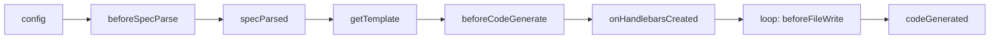

worma 的插件系统允许你在代码生成的各个生命周期阶段介入，修改生成结果。

## 生命周期



## 钩子执行时序

```
config() → beforeSpecParse() → 解析 OpenAPI → specParsed()
→ getTemplate()                ← 插件返回模板路径
→ beforeCodeGenerate(data)     ← 插件注入配置数据到 templateData
→ onHandlebarsCreated(hbs)     ← 可注册自定义 helpers/partials
→ 流式渲染 + 写盘：
    loop 每个文件:
       beforeFileWrite(filePath, content)  ← 插件修改单文件内容
       writeFile(filePath)
→ codeGenerated(filePaths, renderTemplate)     ← 通知 / 生成额外文件（aiDoc 等）
```

## 钩子概览

| 钩子                   | 时机             | 可修改           | config 状态 |
| ---------------------- | ---------------- | ---------------- | ----------- |
| `config`               | 配置解析后       | config           | 可修改      |
| `beforeSpecParse`   | 规范解析前       | 原始规范文本 spec | 已冻结      |
| `specParsed`        | OpenAPI 解析后   | document         | 已冻结      |
| `getTemplate`          | 模板加载前       | 模板路径         | 已冻结      |
| `beforeCodeGenerate`   | 代码生成前       | TemplateData     | 已冻结      |
| `onHandlebarsCreated`  | Handlebars 实例创建后 | hbs 实例 / partials / helpers | 已冻结 |
| `beforeFileWrite`      | 每个文件写盘前   | 单个文件内容     | 已冻结      |
| `codeGenerated`        | 全部文件写盘后   | filePaths / 通过 renderTemplate 渲染额外模板 | 已冻结      |

## 进度报告

如果插件内存在耗时操作，可通过 `reportProgress` 报告插件内的处理进度。每个插件实例绑定独立的 `reportProgress`，以插件 `name` 作为 source 标识：

```typescript
type ReportProgress = (progress: number, message?: string) => void;
```
