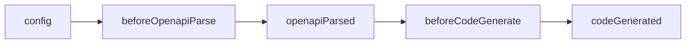

wormhole 的插件系统允许你在代码生成的各个生命周期阶段介入，修改生成结果。

## 生命周期



每个 hook 接收的参数对象统一包含 `reportProgress` 和 `projectPath`：

| 钩子 | 时机 | 可修改 | config 状态 |
|------|------|--------|------------|
| `config` | 配置解析后 | config | 可修改 |
| `beforeOpenapiParse` | OpenAPI 解析前 | — | 已冻结 |
| `openapiParsed` | OpenAPI 解析后 | document | 已冻结 |
| `beforeCodeGenerate` | 代码生成前 | TemplateData | 已冻结 |
| `codeGenerated` | 代码生成后 | files | 已冻结 |

## reportProgress 机制

每个插件实例绑定独立的 `reportProgress`，以插件 `name` 作为 source 标识：

```typescript
type ReportProgress = (progress: number, message?: string) => void;
```

> 插件未声明 `name` 时，统一以 `'plugin'` 作为 source（多个匿名插件之间会覆盖）。

## 完整类型定义

```typescript
type ReportProgress = (progress: number, message?: string) => void;

interface ApiPlugin {
  name?: string;
  config?: (params: {
    config: GeneratorConfig;
    projectPath: string;
    reportProgress: ReportProgress;
  }) => MaybePromise<GeneratorConfig | undefined | null | void>;

  beforeOpenapiParse?: (params: {
    config: Readonly<GeneratorConfig>;
    projectPath: string;
    reportProgress: ReportProgress;
  }) => void;

  openapiParsed?: (params: {
    config: Readonly<GeneratorConfig>;
    document: OpenAPIDocument;
    projectPath: string;
    reportProgress: ReportProgress;
  }) => MaybePromise<OpenAPIDocument | undefined | null | void>;

  beforeCodeGenerate?: (params: {
    config: Readonly<GeneratorConfig>;
    data: TemplateData;
    projectPath: string;
    reportProgress: ReportProgress;
  }) => MaybePromise<string | undefined | null | void>;

  codeGenerated?: (params: {
    config: Readonly<GeneratorConfig>;
    data: TemplateData;
    files: Record<string, string>;
    projectPath: string;
    error?: Error;
    reportProgress: ReportProgress;
  }) => MaybePromise<void>;
}
```
