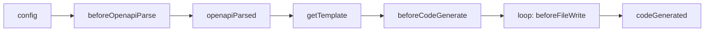

worma 的插件系统允许你在代码生成的各个生命周期阶段介入，修改生成结果。

## 生命周期



## 钩子执行时序

```
config() → beforeOpenapiParse() → 解析 OpenAPI → openapiParsed()
→ getTemplate()                ← 插件返回模板路径
→ beforeCodeGenerate(data)     ← 插件注入配置数据到 templateData
→ 流式渲染 + 写盘：
    loop 每个文件:
       beforeFileWrite(filePath, content)  ← 插件修改单文件内容
       writeFile(filePath)
→ codeGenerated(filePaths)     ← 通知 / 生成额外文件（aiDoc 等）
```

## 钩子概览

| 钩子 | 时机 | 可修改 | config 状态 |
|------|------|--------|------------|
| `config` | 配置解析后 | config | 可修改 |
| `beforeOpenapiParse` | OpenAPI 解析前 | — | 已冻结 |
| `openapiParsed` | OpenAPI 解析后 | document | 已冻结 |
| `getTemplate` | 模板加载前 | — | 已冻结 |
| `beforeCodeGenerate` | 代码生成前 | TemplateData | 已冻结 |
| `beforeFileWrite` | 每个文件写盘前 | 单个文件内容 | 已冻结 |
| `codeGenerated` | 全部文件写盘后 | filePaths | 已冻结 |

### 与旧版的关键区别

| 维度 | v1 旧设计 | v2 新设计 |
|------|----------|----------|
| hook 命名 | `afterOpenapiParse`, `afterCodeGenerate` | `openapiParsed`, `codeGenerated` |
| hook 参数 | 位置参数 | 统一对象参数 |
| `beforeCodeGenerate` 返回值 | `MaybePromise<string \| void>` | `MaybePromise<void>`，直接修改 `params.data` |
| 文件修改方式 | `codeGenerated` 通过 `files` 修改 | `beforeFileWrite` 逐个文件修改 |
| `codeGenerated` 参数 | 持有 `files`（阻塞流式） | 仅有 `filePaths`（流式友好） |

## reportProgress 机制

每个插件实例绑定独立的 `reportProgress`，以插件 `name` 作为 source 标识：

```typescript
type ReportProgress = (progress: number, message?: string) => void;
```

> 插件未声明 `name` 时，统一以 `'plugin'` 作为 source（多个匿名插件之间会覆盖）。

## 完整类型定义

```typescript
type ReportProgress = (progress: number, message?: string) => void;

interface ApiPlugin {
  name?: string;

  /** ① 配置阶段：可修改 config */
  config?: (params: {
    config: GeneratorConfig;
    projectPath: string;
    reportProgress: ReportProgress;
  }) => MaybePromise<GeneratorConfig | undefined | null | void>;

  /** ② OpenAPI 解析前 */
  beforeOpenapiParse?: (params: {
    config: Readonly<GeneratorConfig>;
    projectPath: string;
    reportProgress: ReportProgress;
  }) => void;

  /** ③ OpenAPI 解析后：可修改 document */
  openapiParsed?: (params: {
    config: Readonly<GeneratorConfig>;
    document: OpenAPIDocument;
    projectPath: string;
    reportProgress: ReportProgress;
  }) => MaybePromise<OpenAPIDocument | undefined | null | void>;

  /** ④ 获取模板路径 */
  getTemplate?: (params: {
    config: Readonly<GeneratorConfig>;
    projectPath: string;
    reportProgress: ReportProgress;
  }) => MaybePromise<TemplateConfigResult | undefined | null | void>;

  /** ⑤ 渲染前：注入/修改 templateData */
  beforeCodeGenerate?: (params: {
    config: Readonly<GeneratorConfig>;
    data: TemplateData;
    projectPath: string;
    reportProgress: ReportProgress;
  }) => MaybePromise<void>;

  /** ⑥ 每个文件写盘前：可修改单个文件内容 */
  beforeFileWrite?: (params: {
    filePath: string;
    content: string;
    fileName: string;
    tag?: string;
    api?: string;
    config: Readonly<GeneratorConfig>;
    data: TemplateData;
    projectPath: string;
    isNoOverwrite: boolean;
  }) => MaybePromise<string | void>;

  /** ⑦ 所有文件写盘完成后 */
  codeGenerated?: (params: {
    config: Readonly<GeneratorConfig>;
    data: TemplateData;
    filePaths: string[];
    projectPath: string;
    outputDir: string;
    error?: Error;
    reportProgress: ReportProgress;
  }) => MaybePromise<void>;
}
```
