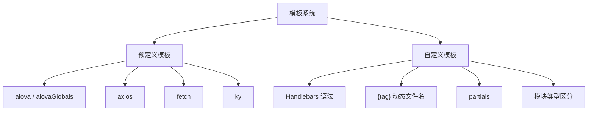

模板是 wormhole 灵活性的核心。它决定了生成代码的结构、风格和请求方式。wormhole 提供多套内置模板，同时支持完全自定义的 Handlebars 模板。



### 模板配置

通过 `template` 配置项指定：

```javascript
import { defineConfig } from 'worma';
import { alova, axios, fetch, ky } from 'worma/template';

export default defineConfig({
  generator: [
    {
      template: axios(),
    },
  ],
});
```

### 模板函数签名

```typescript
interface TemplateConfig {
  // 模板路径
  path: string;
  // 自定义模板参数
  config: Record<string, any>;
}

// 模板配置函数
function templateConfig(): TemplateConfig | Promise<TemplateConfig>;
```

接下来：[预定义模板](/docs/guide/04-template-system/predefined-templates) | [自定义模板](/docs/guide/04-template-system/custom-templates) | [模板参数参考](/docs/guide/04-template-system/template-data)
