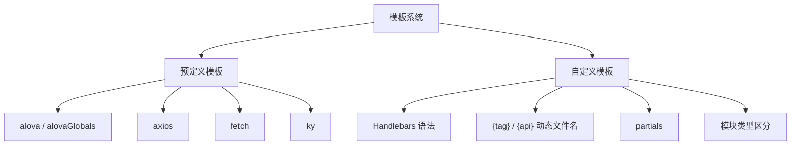

模板是 worma 灵活性的核心。它决定了生成代码的结构、风格和请求方式。worma 提供多套内置模板，同时支持完全自定义的 Handlebars 模板。



### 模板配置

模板不再通过 `template` 配置项指定，而是通过**插件**（plugin）的 `getTemplate` hook 返回模板路径：

```javascript
import { defineConfig } from 'worma';
import { alova, axios, fetch, ky, alovaGlobals } from 'worma/plugin';

export default defineConfig({
  generator: [
    {
      plugins: [alova({ framework: 'vue' })],
    },
  ],
});
```

插件可在各自的 `beforeCodeGenerate` 生命周期中向 `templateData.config` 注入配置参数。多插件有返回 template 时以最后一个有效的 template 返回值为准。

### 模板机制

```typescript
// 插件通过 getTemplate hook 返回模板路径
interface TemplateConfigResult {
  // 模板路径（相对或绝对，相对是相对于 process.cwd()）
  path: string;
}

interface ApiPlugin {
  getTemplate?: (params: {
    config: Readonly<GeneratorConfig>;
    projectPath: string;
    reportProgress: ReportProgress;
  }) => MaybePromise<TemplateConfigResult | undefined | null | void>;
}
```

接下来：[预定义模板](/docs/template-system/predefined-templates) | [自定义模板](/docs/template-system/custom-templates)
